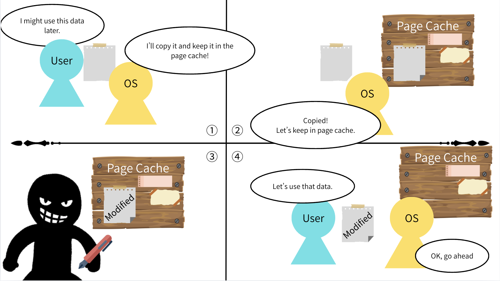

# Silent Memory Corruption: How Copy Fail Breaks Trust in Linux Systems

## 1. Introduction
Recently, the "Copy Fail" vulnerability has attracted attention, as it affects major Linux distributions.

As a Linux user and someone interested in memory corruption, I wanted to better understand how it works.

This article explains the Copy Fail vulnerability from a beginner-friendly cybersecurity perspective.

## 2. Why Copy Fail is unique
Based on explanations from security researchers, Copy Fail stands out due to the following characteristics:

- No race condition  
  Many Linux vulnerabilities rely on timing issues, but Copy Fail does not.

- No brute force  
  It does not require repeated attempts or fine-tuning across different environments.

- Small change, big impact  
  A modification of only a few bytes can lead to privilege escalation.

## 3. What is Copy Fail
Copy Fail (CVE-2026-31431) is a local privilege escalation vulnerability in the Linux kernel, disclosed in April 2026.

It allows a local attacker to gain root privileges by exploiting how the kernel handles certain memory operations.

Importantly, the vulnerability does not directly modify files on disk. Instead, it affects how file data is stored and used in memory.

## 4. Setuid and Root

`Setuid` is a permission setting in operating systems that allows a user to execute a program with the privileges of another user.

When a file has the `setuid` bit enabled and is owned by root, it runs with root privileges instead of the user who executed it.

Root is the highest privilege level on a computer system. A root user can perform any operation that other users can, and more.

Gaining root privileges means a malicious actor can read, write, and execute anything on the system.

## 5. The Key Point: Page Cache

The page cache is a memory management mechanism used by the Linux kernel to store file data in memory for faster access.

When a file is read from disk, a copy is stored in memory. Future operations use this cached copy instead of reading from disk again.

In Copy Fail, this mechanism can be abused. Instead of safely copying data, the kernel ends up allowing unintended modification of the cached data in memory.

## 6. What Goes Wrong

One of the most dangerous aspects of this vulnerability is that it is difficult for users to notice.

The file on disk remains unchanged, so integrity checks and file inspections appear normal.

However, the system actually executes the modified data stored in the page cache.

As a result, users may trust a file that appears safe, while its in-memory version has already been altered.

## 7. Why this is Dangerous

The core problem is that the attacker can modify parts of a program that should never be writable in the first place.

Because these areas are assumed to be safe, they are not normally checked for modification.

Even a small change in such a protected area can significantly alter a program’s behavior.

For example, changing a condition from “**don't allow** if the user is not root” to “**allow**” can bypass a security check.

## 8. Realistic Attack Scenario

In what situations could this vulnerability actually affect us?

Here are three common scenarios:

### 8-1. Web App

A vulnerability in a web application can serve as an entry point for an attacker.

For example, an attacker may exploit a bug (such as command injection or file upload) to gain access to the server with low privileges.

From there, the Copy Fail vulnerability can be used to escalate privileges to root and take full control of the system.

### 8-2. Malware

A user may accidentally download and run malware by clicking an unknown link on a website or in a phishing email.

In such cases, the malware typically runs with normal user privileges.

However, if the system is vulnerable to Copy Fail, the malware can exploit it to escalate privileges to root and take full control of the system.

### 8-3. Shared Server

Shared servers are commonly used in colleges and companies, where multiple users have access to the same system.

If one user account is compromised, the attacker may gain low-level access to the server.

In such environments, the Copy Fail vulnerability can be used to escalate privileges to root.

Once root access is obtained, the attacker can access sensitive data, modify system settings, and potentially use the server as a stepping stone to attack other systems on the network.

## 9. Mitigation

Since this vulnerability exists in the Linux kernel, it is strongly recommended to apply security updates provided by your distribution.

Rebooting the system is also important, as it clears the page cache.

## 10. Conclusion

I once heard a common rule in safe coding: "Don't write the same code twice," because duplicated logic can lead to mistakes.

While Copy Fail is not caused by duplicated code, it reminded me of a similar idea: **even trusted mechanisms like copying data can fail in unexpected ways.**

Even when files on disk appear clean, the system may execute altered data stored in memory. This breaks a fundamental assumption: that what we see is what gets executed.

Through this vulnerability, I learned that memory corruption is not limited to stack-based or heap-based attacks. Compared to these, Copy Fail is much more subtle.

I was also surprised to learn that there are no built-in mechanisms to verify the integrity of data stored in the page cache.

This vulnerability is not a simple overwrite of a file. It happens through specific kernel operations that unintentionally modify cached data in memory.

I would like to continue exploring about such vulnerabilities in the future.
